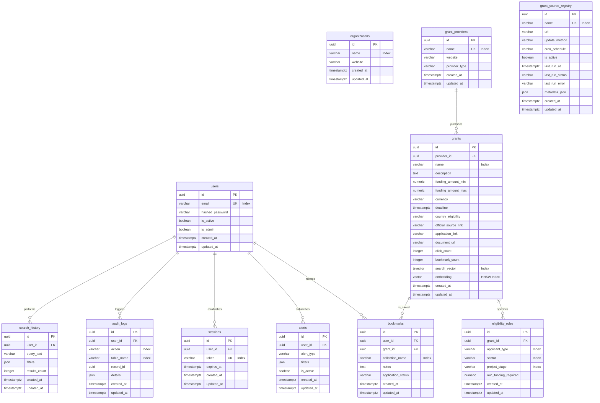

# Database Schema: GrantFinder Platform

This document describes the relational database schema of the GrantFinder platform, mapped directly from the Python SQLAlchemy 2.0 ORM models. All tables use `UUID` for primary keys and contain automatic UTC timezone-aware auditing timestamps.

---

## Entity Relationship Diagram (ERD)

---

## Table Columns and Constraints Specification

### 1. `users`
Tracks authenticated user details.
- **Indexes**:
  - `ix_users_id`: Primary key index.
  - `ix_users_email`: Unique index on email address.

### 2. `organizations`
General registry for companies, startups, and institutions using the platform.
- **Indexes**:
  - `ix_organizations_name`: Index on name for fast lookups.

### 3. `grant_providers`
Companies, government agencies, and foundations that issue grants.
- **Indexes**:
  - `ix_grant_providers_name`: Unique index on publisher name.

### 4. `grant_source_registry`
Pipeline manager for configuring RSS feeds, site scrapers, and external APIs.
- **Indexes**:
  - `ix_grant_source_registry_name`: Unique index on registry source name.

### 5. `grants`
Core grant record details.
- **Indexes**:
  - `ix_grants_name`: Index on grant name.
  - `ix_grants_provider_id`: Index on foreign key relationship to provider.
  - `grants_search_vector_idx`: PostgreSQL `GIN` index on `search_vector` column to support Full-Text keyword queries.
  - `grants_embedding_cosine_idx`: `HNSW` vector index on the 1536-dimensional `embedding` column using `vector_cosine_ops` operator class for cosine similarity semantic searches.

### 6. `eligibility_rules`
Scraped and normalized constraints for matching engines.
- **Indexes**:
  - `ix_eligibility_rules_grant_id`: Index on foreign key.

### 7. `bookmarks`
User saved grants folder.
- **Indexes**:
  - `ix_bookmarks_user_id`: Index on foreign key.
  - `ix_bookmarks_grant_id`: Index on foreign key.

### 8. `alerts`
Configured triggers for alerts and search preferences.
- **Indexes**:
  - `ix_alerts_user_id`: Index on foreign key.

### 9. `search_history`
Search logs.
- **Indexes**:
  - `ix_search_history_user_id`: Index on foreign key.

### 10. `sessions`
Secure login user tokens.
- **Indexes**:
  - `ix_sessions_token`: Unique index on active login JWT tokens.

### 11. `audit_logs`
System change trails.
- **Indexes**:
  - `ix_audit_logs_action`: Index on action column.
  - `ix_audit_logs_table_name`: Index on changed database table name.
